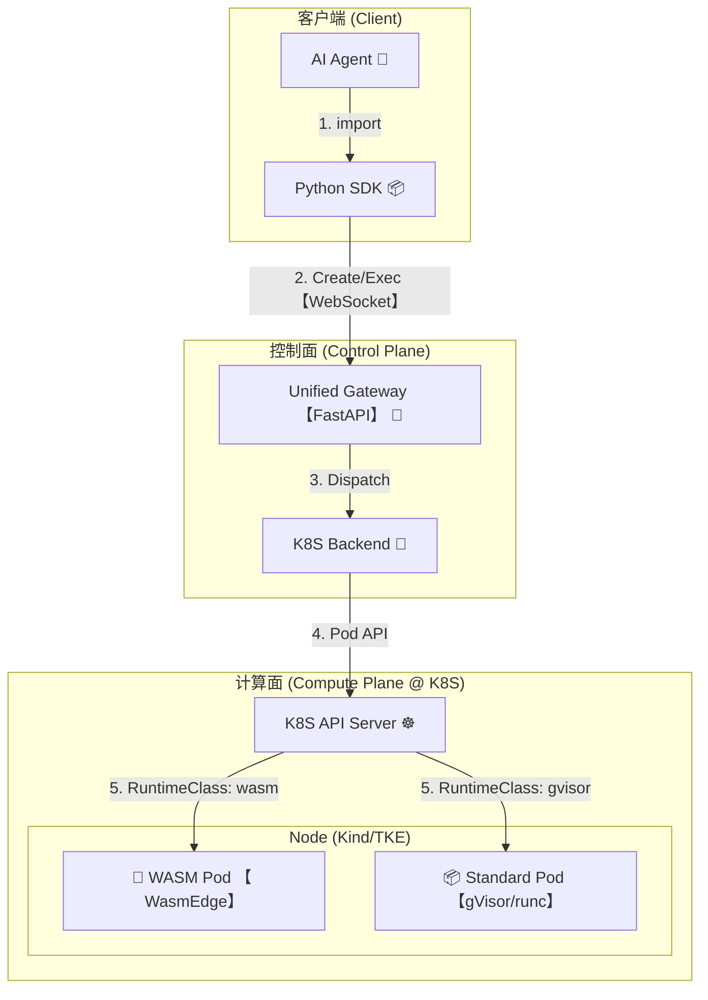

# Unified AI Sandbox Platform (MVP)

这是一个 **"三位一体" (Unified Trinity)** 的 AI Sandbox 平台原型。
它允许 AI Agent 通过统一的 SDK，将代码分发到不同的安全运行时（**WASM**, **Firecracker**, **gVisor**）中执行。

> 📚 **深度阅读**:
>
> - [行业巨头(Google/OpenAI)是如何实现 Sandbox 的?](docs/industry_comparison.md)
> - [gVisor 集成指南 (VMware/Kind)](docs/install_gvisor.md)

---

## 1. 核心架构 (Architecture)

我们采用了 **控制面 (Gateway)** 与 **计算面 (Runtime)** 分离的设计。



---

## 2. 核心架构策略 (The Trinity Strategy)

Master, 您的总结非常精准！这就是我们架构的精髓：

| 层级                | 技术栈              | 角色定位 (Role)         | 适用场景                                                                                                                  |
| :------------------ | :------------------ | :---------------------- | :------------------------------------------------------------------------------------------------------------------------ |
| **Tier 1 (极速层)** | **WASM** (WasmEdge) | **"Flash" (闪电侠)**    | 纯逻辑计算、轻量级函数、无状态任务。启动快 (ms级)。                                                                       |
| **Tier 2 (主力层)** | **gVisor** (Google) | **"Iron Man" (钢铁侠)** | **主力军**。跑 Python, Pandas, Numpy。兼容性好，无需 KVM 也能跑 (Ptrace)，在 VMware 环境下是首选。                        |
| **Tier 3 (重装层)** | **Kata + QEMU**     | **"Hulk" (绿巨人)**     | **终极防线**。硬件级 VM 隔离。由 `kata-deploy` DaemonSet 自动注入，对你是透明的。 [查看原理](docs/kata_implementation.md) |

> **当前状态**: 您现在已经完美落地了 **Tier 1 (WASM)**, **Tier 2 (gVisor)** 和 **Tier 3 (Kata QEMU)**。全能战士已就位！

---

## 3. 代码导航 (Code Walkthrough)

请按照以下顺序阅读代码，理解整个数据流：

### 第一层：入口 (Client Side)

- **`examples/agent_demo.py`**: 这里的代码模拟了一个 AI Agent。它调用 `sdk` 来创建沙箱并执行斐波那契数列计算。
- **`sdk/sandbox.py`**: 这是给 Agent 用的客户端库。
  - `create()`: 发送 HTTP POST 请求到网关。
  - `exec()`: 建立 WebSocket 连接，发送执行指令。

### 第二层：大脑 (Gateway)

- **`gateway/main.py`**: 整个系统的入口服务 (FastAPI)。
  - `POST /sandboxes`: 接收创建请求，决定用哪个 Runtime (WASM 还是 Standard)。
  - `WebSocket /connect/{id}`: 处理长连接，把前端发来的 `exec` 指令转发给后端 K8S。
- **`gateway/backends/k8s_backend.py`**: **核心逻辑所在**。
  - `create_pod()`: 真正调用 Kubernetes API 创建 Pod。这里会根据 `runtime="wasm"` 自动注入 `runtimeClassName: wasm-edge-v1`。
  - `exec_command()`: 调用 K8S 的 `stream` 接口，在 Pod 内执行命令。

### 第三层：基础设施 (Infrastructure)

- **`infra/setup_kwasm.sh`**: "一键安装脚本"。它负责给 K8S 集群安装 WASM 支持 (KWasm Operator)。
- **`infra/manifests/runtimeclass.yaml`**: 告诉 K8S "wasm-edge-v1" 到底是什么 (由哪个 runtime handler 处理)。

---

## 3. 快速开始 (Quick Start)

### 前置条件

- 本地已安装 `Kind` 和 `Docker`。
- 本地已安装 `Python 3.10+`。

### 第一步：环境准备

```bash
# 1. 启动 Kind 集群 (如果您还没有)
kind create cluster

# 2. 安装运行时支持 (核心步骤)
# 选项 A: 安装 WASM (必须)
./infra/setup_kwasm.sh

# 选项 B: 安装 gVisor (推荐 - 支持 Python/Pandas)
./infra/setup_gvisor.sh kind-control-plane

# 选项 C: 安装 Kata (可选 - 需嵌套虚拟化)
# ./infra/setup_kata.sh

# 3. 准备 Python 虚拟环境
python3 -m venv venv
source venv/bin/activate
pip install fastapi uvicorn kubernetes websockets requests python-socks
```

### 第二步：运行 Demo (全自动)

我们提供了一个脚本，自动启动网关并运行 Agent Demo：

```bash
./run_demo.sh
```

**您应该能看到类似输出**：

```text
🤖 [Agent] Requesting Python Sandbox...
✅ [Agent] Sandbox Ready!
🚀 [Agent] Sending Command: python -c "..."
📺 [Sandbox Output]: Fib(10) is 55
✨ [Agent] Task Complete!
```

---

## 4. 常见问题 (FAQ)

- **Q: 为什么 WASM Pod 不能执行 `pip install`?**
  - A: WASM 就像一个精简的计算器。我们在 Demo 中使用的是 `wasmedge/example-wasi-http` 镜像，它是只读的纯计算环境。如果您需要 `pip`，请在 `sb.create(runtime="standard")` 中申请标准容器。
- **Q: `runtime="standard"` 是什么？**
  - A: 在我们的 Gateway 中，它目前默认映射到 **gVisor** (如果是安全环境) 或标准容器 (runc)。既然您已经安装了 gVisor，它现在就是安全的 gVisor 沙箱！
