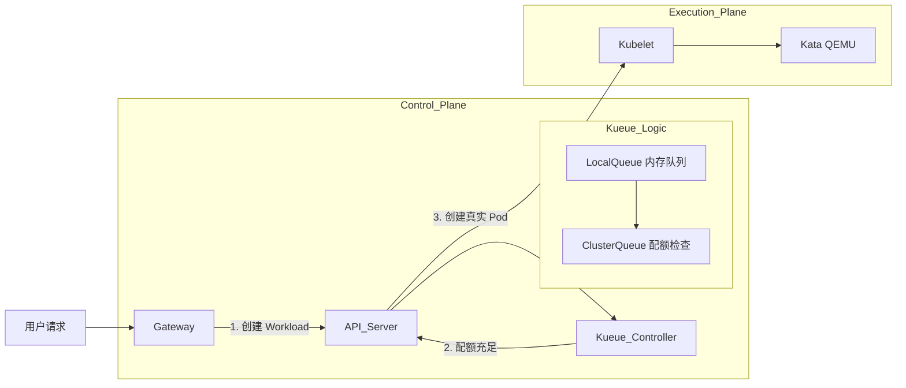

# Kueue: Kubernetes Native Job Queuing 深度解析

**Kueue** (读作 "Q") 是 Kubernetes 社区 (SIG-Scheduling) 退出的官方项目，专门用于解决 **"资源配额紧张时的作业排队"** 问题。

它的核心使命只有一句话：**在 Job 创建之前，先决定它有没有资格运行。**

---

## 1. 核心痛点：为什么要用 Kueue？

### 现状 (Without Kueue)

当你有 100 张 GPU，但来了 200 个任务时：

1.  Gateway 调用 K8s API 创建 200 个 Pod。
2.  **API Server**: "没问题，我收到了。" (API Server 压力激增)
3.  **Scheduler**: "正在调度... 哎呀没资源了。"
4.  **结果**: 100 个 Pod 运行，100 个 Pod 处于 **Pending** 状态。
5.  **后果**:
    - **资源死锁**: 大任务和小任务互相卡死。
    - **性能下降**: 大量 Pending Pod 持续消耗调度器 CPU 资源进行轮询。
    - **无序**: 谁先 Running 全看运气，没有严格的 "先来后到" 或 "VIP 优先"。

### 变革 (With Kueue)

1.  Gateway 不直接创建 Pod，而是创建一个 **Workload** 对象。
2.  Kueue 将 Workload 放入内存队列。
3.  Kueue 检查：集群资源是否足够？
4.  **不够** -> 让 Workload 在队列里乖乖排队 (不创建 Pod，零资源消耗)。
5.  **够了** -> 通知 K8s 创建 Pod。

---

## 2. 核心概念架构

Kueue 引入了几个全新的 CRD 对象，构建了一套逻辑严密的排队系统。

### 2.1 Workload (作业单元)

代表一个"任务请求"。Gateway 不需要直接创建 Pod，而是提交一个 Workload。

- 可以携带 `priorityClassName` (优先级)。
- 可以定义资源需求 (CPU/Mem/GPU)。

### 2.2 LocalQueue (本地队列)

对应 Kubernetes 的 `Namespace`。

- **场景**: 比如你有两个租户：`Team-A` 和 `Team-B`。
- 他们在各自的 Namespace 里提交任务，进入各自的 **LocalQueue**。

### 2.3 ClusterQueue (集群队列)

这是真正的**资源池**。所有 LocalQueue 的任务最终都会汇聚到这里来抢资源。

- **配额管理**: 定义这个队列最多能用多少 CPU/Memory/GPU。
- **策略**: FIFO (先入先出) 或 StrictPriority (优先级严格优先)。
- **抢占 (Preemption)**: 允许高优先级队列抢占低优先级队列的额度。

### 2.4 ResourceFlavor (资源类型)

定义"资源长什么样"。

- 比如：`nvidia-gpu`, `intel-cpu`, `spot-instance`。
- Kueue 可以根据 Flavor 自动给 Pod 加上 NodeSelector 或 Taint/Toleration。

---

## 3. MasLambda 集成方案 (How strictly works)

如果要在您的项目中引入 Kueue，架构图如下：



### 3.1 实际操作流程

1.  **安装 Kueue**:

    ```bash
    kubectl apply -f https://github.com/kubernetes-sigs/kueue/releases/download/v0.6.2/manifests.yaml
    ```

2.  **定义资源池 (ClusterQueue)**:

    ```yaml
    apiVersion: kueue.x-k8s.io/v1beta1
    kind: ClusterQueue
    metadata:
      name: sandbox-pool
    spec:
      namespaceSelector: {} # 监听所有 namespace
      resourceGroups:
        - coveredResources: ["cpu", "memory"]
          flavors:
            - name: default-flavor
              resources:
                - name: "cpu"
                  nominalQuota: 100 # 最多允许 100 核同时运行
                - name: "memory"
                  nominalQuota: 200Gi
    ```

3.  **定义本地入口 (LocalQueue)**:

    ```yaml
    apiVersion: kueue.x-k8s.io/v1beta1
    kind: LocalQueue
    metadata:
      namespace: default
      name: default-queue
    spec:
      clusterQueue: sandbox-pool
    ```

4.  **Gateway 改造**:
    Gateway 不再直接 `v1.create_namespaced_pod`，而是监听 **Workload** 状态。Kueue 官方通过 Webhook 支持直接拦截 Job 创建，或者您可以显式创建 Workload。

---

## 4. 总结：Kueue vs Redis DIY

| 特性           | Redis 自研队列             | Kueue (官方方案)                 |
| :------------- | :------------------------- | :------------------------------- |
| **接入成本**   | 低 (代码里写个 while 循环) | 中 (需要部署 CRD, 配置 Queue)    |
| **功能丰富度** | 低 (只能做简单的计数)      | **极高** (抢占、借用、公平调度)  |
| **稳定性**     | 依赖 Redis 高可用          | 依赖 K8s etcd，架构原生          |
| **可见性**     | 只能看 Redis 数据          | `kubectl get workloads` 一目了然 |
| **推荐指数**   | 适合 MVP 原型              | **适合生产环境大规模部署**       |

**建议**: 如果您预期的并发量仅仅是几百个，Redis 足够了。如果您要做一个能支撑 **上万并发、多租户、区分 VIP 等级** 的商业化 SaaS 平台，**Kueue 是目前云原生领域的唯一标准答案**。

---

## 4. 实战：资源定义的黑魔法 (Resource Definition)

您问到“Kueue 怎么识别资源”，核心在于一套**“三层映射机制”**。它完全复用了 K8s 原生的资源名称（CPU/Memory），不需要发明新词。

### 4.1 第一层：定义“资源类型” (ResourceFlavor)

先定义“这到底是个什么硬件”。对于普通 CPU/内存，通常定义一个默认的 Flavor 即可。

```yaml
apiVersion: kueue.x-k8s.io/v1beta1
kind: ResourceFlavor
metadata:
  name: "default-flavor" # <--- 记住这个名字
```

### 4.2 第二层：定义“资源池配额” (ClusterQueue)

这是最关键的一步。您在这里告诉 Kueue：“我有多少货”。

```yaml
apiVersion: kueue.x-k8s.io/v1beta1
kind: ClusterQueue
metadata:
  name: "sandbox-pool"
spec:
  namespaceSelector: {}
  resourceGroups:
    - coveredResources: ["cpu", "memory", "nvidia.com/gpu"] # 支持原生资源和 CRD 资源
      flavors:
        - name: "default-flavor" # 引用上面的 Flavor
          resources:
            - name: "cpu"
              nominalQuota: 100 # 🟢 核心配置：只允许同时跑 100 核
            - name: "memory"
              nominalQuota: 200Gi # 🟢 核心配置：只允许同时跑 200GB
            - name: "nvidia.com/gpu"
              nominalQuota: 4 # 🟢 核心配置：只允许同时跑 4 张卡
```

### 4.3 第三层：消费者申请 (Workload / Pod)

Gateway 在提交任务时，**完全不需要修改资源申请的写法**。Kueue 会自动拦截并识别标准的 K8s `resources` 字段。

**方式 A: 直接由 Kueue 自动拦截 Job (推荐)**
如果您创建的是 K8s `Job`，Kueue 的 Webhook 会自动暂停它，并生成 Workload。

**方式 B: Gateway 显式创建 Workload (MasLambda 适用)**

```yaml
apiVersion: kueue.x-k8s.io/v1beta1
kind: Workload
metadata:
  name: sb-task-123
spec:
  queueName: default-queue # 指向 LocalQueue
  podSets:
    - count: 1
      name: main
      template:
        spec:
          containers:
            - name: agent
              # 👇 Kueue 就是读取这里！只要这里申请的加起来不超过 ClusterQueue 的配额，就放行。
              resources:
                requests:
                  cpu: "1"
                  memory: "2Gi"
```

### 总结

1.  **Quota 是死线**: `ClusterQueue` 定义了总共有多少 `cpu: 100`。
2.  **Request 是消耗**: 每个 `Workload` 申请 `cpu: 1`。
3.  **Kueue 是会计**: 当 `Running Workloads * 1 > 100` 时，第 101 个任务就会被通过状态机卡在 `Admitted: False` 状态，直到有人释放资源。

---

## 5. 进阶：适配华为昇腾 NPU (Huawei Ascend)

完全没问题！Kueue 对异构硬件的支持是开箱即用的，它遵循 K8s 的 **Extended Resource** 标准。

只需三步即可让 Kueue 识别并调度昇腾 910/310 芯片：

### Step 1: 基础设施准备 (Device Plugin)

必须在节点上安装华为官方的 Device Plugin (Ascend Device Plugin)。它会向 K8s 汇报资源：

- **资源名称**: 通常是 `huawei.com/Ascend910` 或 `huawei.com/Ascend310`。

### Step 2: 告诉 Kueue 纳管这个资源

修改 `ClusterQueue` 配置，把华为的资源名加进去。

```yaml
apiVersion: kueue.x-k8s.io/v1beta1
kind: ClusterQueue
metadata:
  name: "ai-pool"
spec:
  resourceGroups:
    - coveredResources: ["cpu", "memory", "huawei.com/Ascend910"] # 👈 重点：把 NPU 名字加在这里
      flavors:
        - name: "ascend-flavor"
          resources:
            - name: "huawei.com/Ascend910"
              nominalQuota: 16 # 假设我们有 2 台 8 卡机器，总共 16 张卡
```

### Step 3: 用户申请

不需要改任何代码，您的 Agent Pod 只需要像申请 GPU 一样申请 NPU：

```yaml
resources:
  requests:
    huawei.com/Ascend910: 1 # 👈 告诉 Kueue 我要一张昇腾卡
  limits:
    huawei.com/Ascend910: 1
```

> **注意**: 如果您使用的是 Kata 容器，还需要确保 `kata-config` 里的 QEMU 开启了 VFIO 透传 (`enable_iommu = true`)，这样 NPU 才能穿透到虚拟机里给 Agent 用。
