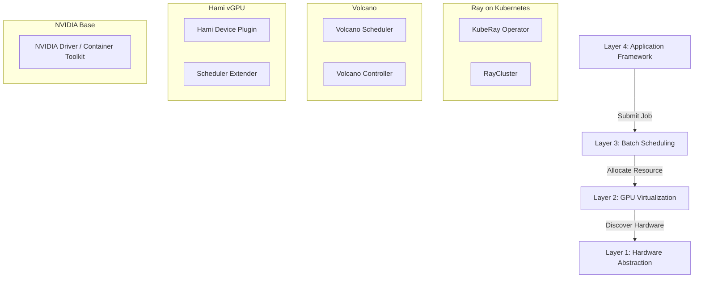

# masCompute: AI 算力平台架构 (AI Compute Platform)

`masCompute` 是一个基于 Kubernetes 的高性能 AI 算力底座，旨在为上层 Agent 提供异构、弹性、高效的算力支持。

## 架构概览 (The 4-Layer Stack)

我们采用业界最成熟的分层架构，实现了从底层硬件到上层 AI 任务的全链路管理。



---

## 详细组件说明

### Layer 1: 硬件抽象层 (Hardware Abstraction)

- **组件**: `01_nvidia_base.yaml`
- **核心职能**: 这里的假设是宿主机已安装 NVIDIA Driver。此层主要负责在 K8s 中部署 NVIDIA Container Toolkit 和基础 Device Plugin，使 Node 能上报 `nvidia.com/gpu` 资源。

### Layer 2: 虚拟化与切分层 (Virtualization)

- **组件**: `02_hami_vgpu.yaml` (Project Hami, formally 4Paradigm/k8s-device-plugin)
- **核心职能**:
  - **显存切分**: 允许一张 A100 (80G) 跑 4 个不同显存需求的任务 (e.g., 20G, 10G, 40G, 10G)。
  - **硬隔离**: 通过劫持 CUDA API 调用，强制限制显存和算力配额。
  - **资源视角**: 将 `nvidia.com/gpu` 转换为精细化的虚拟资源（如 `hami.io/vgpu-memory`）。

### Layer 3: 批处理调度层 (Batch Scheduling)

- **组件**: `03_volcano_scheduler.yaml`
- **核心职能**:
  - **Gang Scheduling**: 比如一个 Ray Cluster 需要 1 个 Head 和 4 个 Worker，Volcano 保证这 5 个 Pod 要么一起调度成功，要么都排队，防止资源死锁（Partial Allocation）。
  - **Queue Management**: 支持多租户队列，保证不同团队（Team A, Team B）的资源公平共享 (Fair Share)。

### Layer 4: 分布式框架层 (Distributed Framework)

- **组件**: `04_ray_cluster.yaml`
- **核心职能**:
  - **Ray on K8s**: 上层 AI 工程师的直接入口。
  - **自动协同**: Ray Operator 生成 Pod -> Volcano 调度 Pod -> Hami 切分 GPU -> 最终运行代码。

---

## 部署顺序

```bash
# 1. Base
kubectl apply -f 01_nvidia_base.yaml

# 2. Hami (vGPU)
kubectl apply -f 02_hami_vgpu.yaml

# 3. Volcano (Scheduler)
kubectl apply -f 03_volcano_scheduler.yaml

# 4. Ray Cluster (Example Workload)
kubectl apply -f 04_ray_cluster.yaml
```
